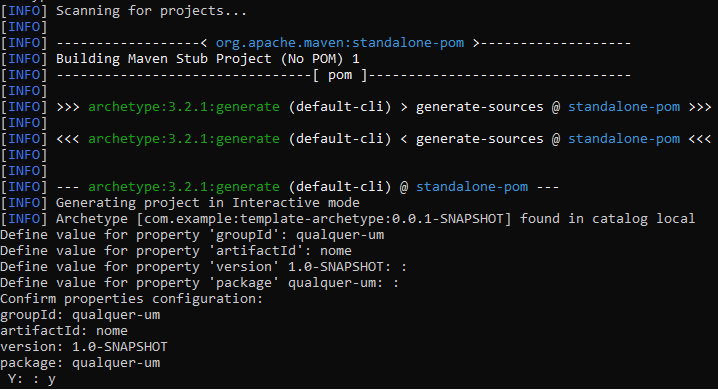
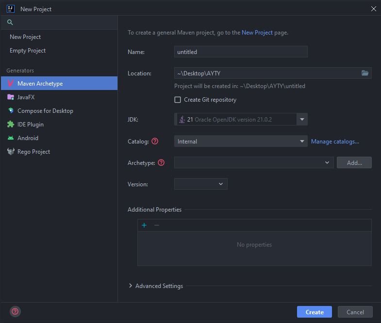
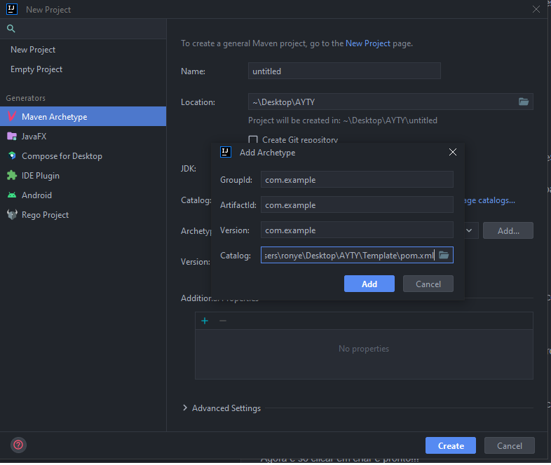

# 🚀 Project Template

Um **template padrão de projeto** para facilitar e agilizar o desenvolvimento com funcionalidades modernas e práticas.

---

## 📋 Funcionalidades do Projeto

- 🔒 **Autenticação e Autorização**: Spring Security e JWT.
- 👥 **Gerenciamento de Usuários**:
    - Diferentes cargos: Comuns e Admins.
    - CRUD completo.
- 🐳 **Dockerização**: Dockerfile e docker-compose configurados.
- 🧪 **Testes Automatizados**:
    - Testes unitários e de integração para usuários.
- 🗄️ **Conexão com Banco de Dados**:
    - H2 (teste local).
    - PostgreSQL (local e produção).
- 🛠️ **Melhorias no Workflow do GitHub**:
    - Templates para issues e pull requests.
    - 2 pipelines de workflow:
        - Build e test.
        - Criação, autenticação e deploy da imagem Docker.
- 🌐 **Configurações Avançadas**:
    - CORS e WebSocket.
    - Swagger para documentação.

---

## 📦 Como Copiar o Projeto

1. Clone o repositório para a sua máquina:
   ```bash
   git clone https://github.com/RonyAbreu/Template-Project.git
   
### Você pode seguir pelo terminal, ou pela interface da dua IDE (As duas opções estão abaixo)

## Pelo terminal
1. Você vai digitar esse comando para iniciar a cópia do projeto
    ```bash
       mvn archetype:generate -DarchetypeGroupId=com.example -DarchetypeArtifactId=template-archetype
   
2. Então você vai poder alterar as informações do projeto que vem padrão, para as informações do seu projeto.



### Digite o nome do seu groupId, artifactId, packageName. Na version basta deixar a padrão
### Depois digite **Y** no terminal e tecle **ENTER**

---

## Pela Interface da IDE

- Você vai abrir a sua IDE e clicar para criar um novo projeto, com maven archetype (como mostra na imagem abaixo):


---

- Depois você vai clicar no botão de adicionar archetype, e vai colocar as informações abaixo (**NO CAMINHO DO ARQUIVO, VOCÊ DEVE COLOCAR O CAMINHO DO POM.XML QUE ESTÁ NA SUA MÁQUINA**):


- ## **Agora é só clicar em criar e pronto!!!**

